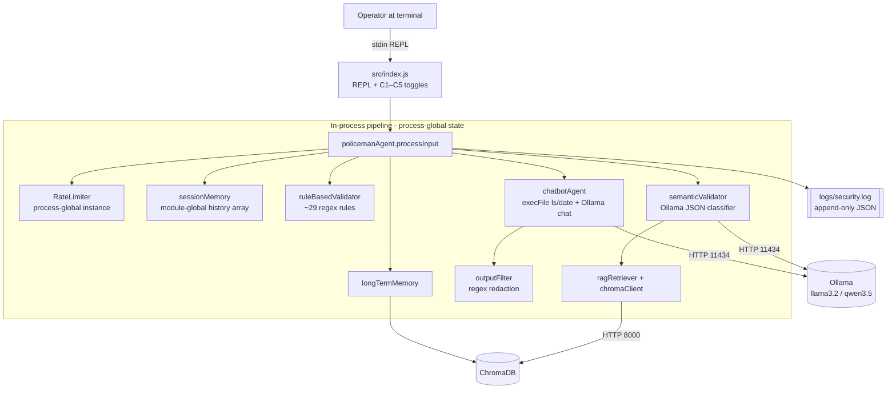
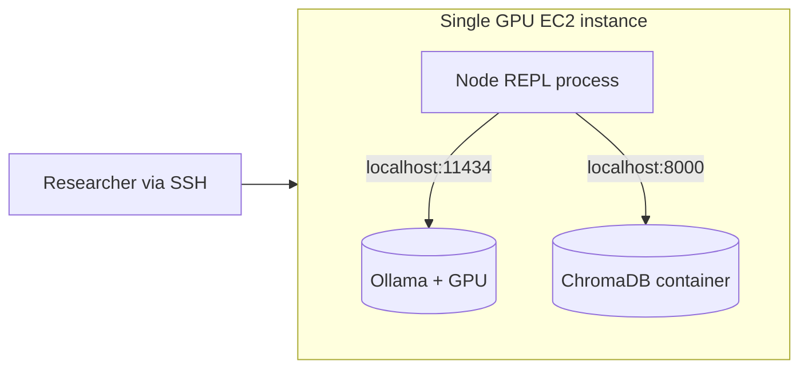
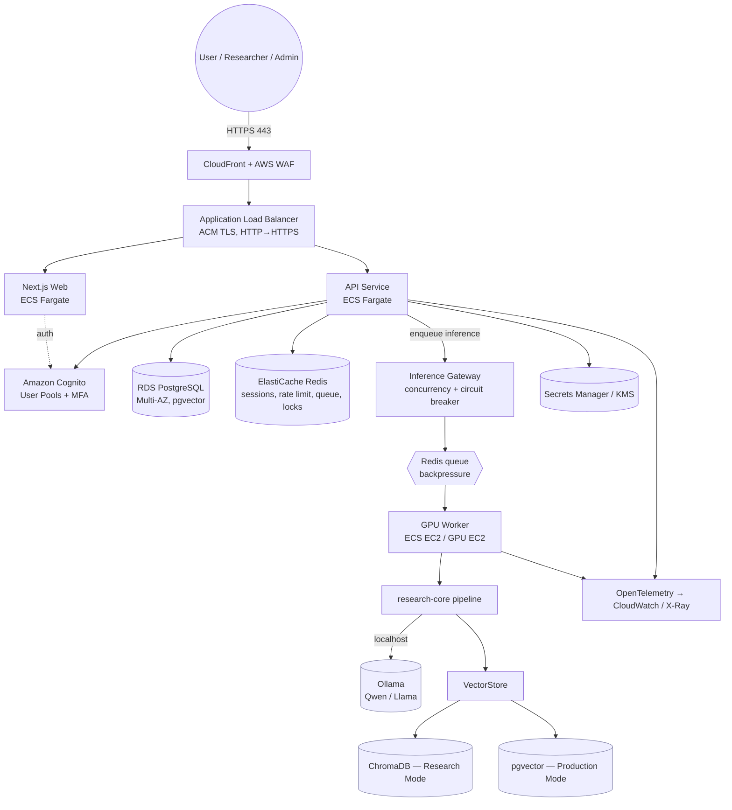
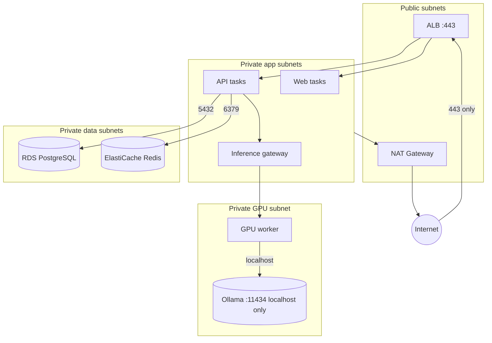
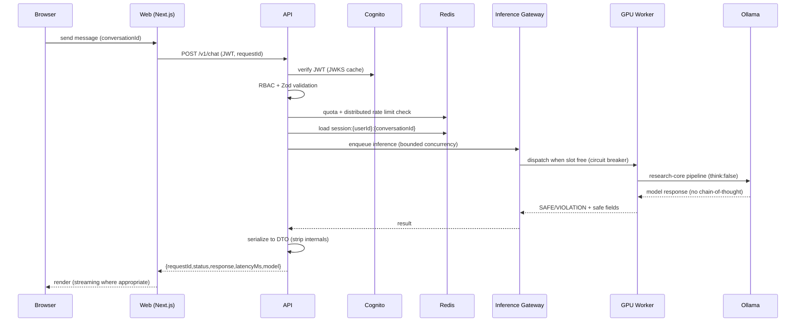

# Architecture — Current vs. Target

**Status:** the *current* architecture is implemented and running. The *target*
architecture is a **design** to be built in phases (see
`docs/IMPLEMENTATION_PLAN.md`). Nothing in the target section should be read as
"already built." Diagrams use Mermaid.

---

## 1. Current architecture (as‑built, commit `42e0ab7`)

A single Node.js process, driven by a terminal REPL, orchestrating a hybrid
rule + local‑LLM defense pipeline over Ollama, with an optional ChromaDB RAG
sidecar and file‑based logging. Single user, single process, single host.



**Request flow:** rate‑limit → session‑memory context → rule validation →
semantic validation (+RAG) → combine (hybrid) → if safe, extract & `execFile`
allowed commands (or Ollama chat) → output filter → log. Ollama down ⇒ semantic
step **fails open** to rules‑only (by design, for reproducibility).

**C1–C5 presets** (research ablation) toggle which layers are active:

| Preset | Rules | Semantic | Rate limit | Session memory | RAG |
|---|---|---|---|---|---|
| C1 | ✓ | | | | |
| C2 | | ✓ | | | |
| C3 | ✓ | ✓ | | | |
| C4 | ✓ | ✓ | ✓ | ✓ | |
| C5 | ✓ | ✓ | ✓ | ✓ | ✓ |

### Current deployment (as described for the research EC2)



Risk: if any of 11434 / 8000 / (a future) 3000 / 3001 are opened in the security
group, internal services are directly internet‑reachable. §22 forbids this.

---

## 2. Target architecture (design — to be built in phases)

### 2.1 Target repository layout (monorepo, incremental)

The research core is **extracted and wrapped**, never rewritten:

```
/
├── apps/
│   ├── web/          # Next.js + TypeScript + Tailwind + shadcn/ui (premium UI)
│   ├── api/          # Node/TypeScript HTTP API: authN/Z, quotas, DTOs, RBAC
│   └── worker/       # Inference worker: consumes queue, calls research-core
├── packages/
│   ├── research-core/  # the EXISTING pipeline, extracted verbatim behind interfaces
│   ├── database/       # Prisma schema, client, migrations
│   ├── auth/           # Cognito integration + session/JWT verification
│   ├── security/       # typed errors, input schemas (Zod), redaction, headers
│   ├── billing/        # BillingProvider interface + Stripe/Moyasar/HyperPay
│   ├── observability/  # OpenTelemetry + CloudWatch wiring, logger
│   └── shared/         # DTOs, types, constants shared across apps
├── infra/
│   ├── terraform/      # dev / staging / production stacks
│   ├── docker/         # Dockerfile.web / Dockerfile.api / Dockerfile.worker
│   └── nginx/          # local reverse proxy (dev/self-host)
├── scripts/            # existing evaluation + provenance capture (preserved)
├── tests/              # unit / integration / e2e / security / load
├── docs/
└── .github/workflows/  # CI/CD
```

Migration keeps the current `src/` working until `packages/research-core`
replaces it with green tests (strangler‑fig, not big‑bang).

**Status (Phase 1b — DONE/TESTED):** `src/` has been moved into
`packages/research-core/src/` (history preserved). The package exposes a
framework‑free public API (`packages/research-core/index.js`) and infrastructure
interfaces under `providers/` (`InferenceProvider`/`OllamaInferenceProvider`,
`VectorStore`/`ChromaVectorStore`). `apps/api` (Phase 5) consumes the package via
this barrel and never reaches into its internals. `apps/web` and `apps/worker`
remain to be built in later phases.

**Status (Phase 5 — DONE/TESTED):** `apps/api` is a runnable Express service over
research-core with `/healthz`, `/readyz`, and `POST /api/v1/chat`. It enforces a
response DTO (no raw result / reasoning / chain-of-thought), a typed-error
catalogue with a safe error handler, Helmet + strict CORS + CSP, Zod validation
with unknown-key rejection, body-size limits, per-request correlation ids, and an
end-to-end inference timeout. The auth middleware is a boundary placeholder
(anonymous principal) ready for Cognito in Phase 3; distributed rate limiting
(Redis) is Phase 4. The service is not yet fit for public exposure (no auth).

### 2.2 Target logical architecture



### 2.3 Target network isolation (VPC)



**Security‑group rules (least privilege):** Internet→ALB:443 only; ALB→web/api;
api→RDS:5432; api→Redis:6379; api/igw→worker; worker→Ollama on localhost.
**Never** `0.0.0.0/0` → Postgres / Redis / Ollama / ChromaDB. Use SSM Session
Manager instead of SSH.

### 2.4 Research Mode vs. Production Mode

The same `research-core` runs in both modes; behavior differs by explicit flags
so production hardening **never silently changes experimental results** (§3):

| Concern | `RESEARCH_MODE` | `PRODUCTION_MODE` |
|---|---|---|
| Semantic validator when Ollama down | fail‑open (rules only) | fail‑safe (block / degrade to safe refusal) |
| Session memory | shared/global allowed for reproducibility | strictly per `userId:conversationId` |
| Rate limiting | in‑process (as in experiments) | distributed (Redis) |
| Vector store | ChromaDB | pgvector (configurable) |
| Command execution | enabled (`ls`,`date`) | disabled by default; sandboxed if enabled |
| Response shape | full diagnostic object | safe DTO only (researchers get diagnostics via a separate authorized endpoint) |
| C1–C5 presets | first‑class | available to `RESEARCHER` role only |

---

## 3. Sequence — a production chat request (target)



---

## 4. Why these choices (brief §56 rationale)

- **ECS Fargate over Kubernetes:** manageable for a small research/eng team; no
  control‑plane ops burden. GPU worker on ECS‑EC2/GPU EC2 because Fargate lacks
  GPUs.
- **Cognito over home‑grown auth:** offload password storage, MFA, verification,
  reset — reduces the AppSec blast radius (§7).
- **Redis for ephemeral state only** (sessions, rate limit, queue, locks) — never
  the system of record (§29).
- **pgvector optional for production RAG** to cut a stateful service, while
  **ChromaDB stays canonical for research** (§30).
- **Provider interfaces** (`InferenceProvider`, `VectorStore`, `BillingProvider`)
  keep business logic decoupled and swappable (§10, §12, §30).
