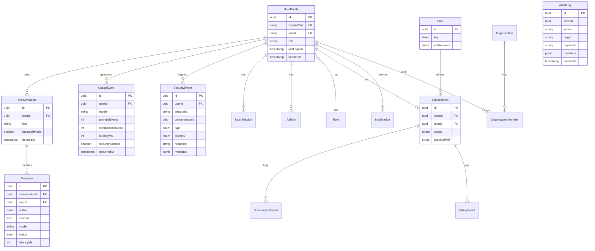

# Implementation Plan

Companion to `docs/PRODUCTION_READINESS_ASSESSMENT.md` and
`docs/ARCHITECTURE.md`. This is the plan the brief (§56) requires to be **shown
before** substantial changes: the refactoring strategy, database design,
security design, and phased execution. Status labels follow the brief (§55):
`NOT IMPLEMENTED` / `PARTIALLY IMPLEMENTED` / `REQUIRES MANUAL CONFIGURATION` /
`TESTED` / `NOT TESTED`.

> **Branch note.** The brief (§50) suggests a `production-hardening` branch. This
> environment mandates development on `claude/upbeat-darwin-ctep8r` and forbids
> pushing elsewhere without explicit permission, so all work lands there. Treat
> `claude/upbeat-darwin-ctep8r` as the production‑hardening line for now.

---

## A. Refactoring strategy (strangler‑fig, not big‑bang)

1. **Freeze behavior with tests.** Baseline recorded: 106 tests green. Every
   phase re‑runs them; a red test blocks the phase.
2. **Extract, don't rewrite.** Move `src/**` into `packages/research-core`
   unchanged, re‑export from the old paths during transition so scripts/tests keep
   working, then flip imports. (Deferred to Phase 1b to avoid churn this milestone.)
3. **Introduce seams (interfaces) around external systems** so production
   concerns attach without touching research logic:
   - `InferenceProvider` (impl: `OllamaProvider`) — concurrency, timeout,
     cancellation, circuit breaker, model‑availability.
   - `VectorStore` (impl: `ChromaVectorStore`, `PgVectorStore`).
   - `BillingProvider` (impl: `StripeBillingProvider`, `MoyasarBillingProvider`, …).
   - `SessionStore` / `RateLimitStore` (impl: in‑memory for research, Redis for prod).
4. **Thread a `context` object** (`{ requestId, userId, conversationId, mode }`)
   through the pipeline instead of relying on module globals. Default context ==
   today's behavior ⇒ reproducibility preserved.
5. **Mode gating.** `RESEARCH_MODE` (default true) keeps experimental behavior;
   `PRODUCTION_MODE` enables isolation/fail‑safe/DTO. Both documented in
   `.env.example`.
6. **API/UI are new apps**, not modifications of the CLI. The CLI remains the
   research entry point.

**This milestone implements #1, #4 (for session/rate state), and #5 scaffolding.**

---

## B. Database design (PostgreSQL + Prisma) — DESIGN, NOT IMPLEMENTED

UUID PKs, `createdAt`/`updatedAt` on every table, soft delete (`deletedAt`) where
noted, FKs enforced, indexes on all lookup/tenant columns. Ownership is enforced
in **every** query: a `Message`/`Conversation` is only ever fetched with
`where: { id, userId }`.

Additional tables: `SubscriptionEvent`, `BillingEvent`, `Notification`,
`SystemConfiguration`, `ApiKey`, `UserSession`, and optional
`Organization`/`OrganizationMember` for future enterprise.

`SecurityEvent.type` ∈ {`PROMPT_INJECTION`,`COMMAND_INJECTION`,`PATH_TRAVERSAL`,
`RATE_LIMIT`,`AUTH_FAILURE`,`MFA_FAILURE`,`ACCOUNT_LOCK`,`SENSITIVE_OUTPUT_BLOCKED`,
`SYSTEM_ABUSE`}. Full malicious prompts are **not** stored by default; when
research retention is enabled, they go to a restricted, encrypted table with a
retention period and pseudonymization (§18, §20).

---

## C. Security design — DESIGN (partial scaffolding this milestone)

- **Identity:** Cognito user pools; JWT verified server‑side against JWKS (cached);
  never trust client role claims for authorization decisions — re‑check against
  `UserProfile.role`.
- **RBAC:** `USER` (chat), `RESEARCHER` (+C1–C5, diagnostics), `ADMIN` (+users,
  plans, config, security events). Enforced in API middleware per route.
- **Input:** Zod schemas on every endpoint; prompt length caps; body size limits;
  reject unknown fields (mass‑assignment defense).
- **Output:** response DTO/serializer strips `reasoning`, rule `evidence`, threat
  internals, and any `thinking` field; typed error catalogue (§43):
  `AUTH_REQUIRED, RATE_LIMITED, QUOTA_EXCEEDED, MODEL_UNAVAILABLE,
  INFERENCE_TIMEOUT, SECURITY_BLOCKED, SERVICE_UNAVAILABLE, INTERNAL_ERROR`.
- **HTTP hardening:** Helmet, strict CORS allowlist, CSP, HSTS, secure/HttpOnly/
  SameSite cookies, CSRF tokens for cookie flows, `requestId` correlation.
- **Rate limiting:** Redis token bucket keyed by user+IP+endpoint+plan; separate
  concurrent‑inference limiter; auth‑failure and signup‑abuse limiters; plus AWS
  WAF rate rules as defense in depth.
- **Command execution:** disabled by default in `PRODUCTION_MODE`; if enabled,
  runs in an isolated non‑root, read‑only, no‑network, resource‑capped sandbox
  container with an allowlisted binary set — never in the web/API process.
- **Secrets:** none in Git; `.env.example` documents every variable; production
  reads from Secrets Manager / SSM via IAM roles (no static keys). Secret scanning
  (Gitleaks) in CI.
- **Chain‑of‑thought:** never requested (`think:false`), never persisted, never
  serialized (DTO enforced).

---

## D. Phased execution

| Phase | Scope | External deps | This milestone |
|---|---|---|---|
| **0** | Audit & baseline; repo hygiene; lockfile reproducibility; provenance capture; mode scaffolding | none | **DONE / TESTED** |
| **1** | Session isolation in research core (context‑keyed session + rate state) | none | **DONE / TESTED** |
| 1b | Extract `packages/research-core`; provider interfaces (`InferenceProvider`,`VectorStore`) | none | NOT IMPLEMENTED |
| 2 | Database + Prisma schema + migrations | Postgres (local ok) | NOT IMPLEMENTED |
| 3 | AuthN/AuthZ (Cognito + RBAC middleware) | **Cognito** | NOT IMPLEMENTED / REQUIRES MANUAL CONFIG |
| 4 | Redis session isolation + distributed rate limiting | Redis (local ok) | NOT IMPLEMENTED |
| 5 | API service: DTOs, typed errors, Helmet/CORS/CSP, Zod, `/healthz`+`/readyz` | none (local) | NOT IMPLEMENTED |
| 6 | Premium Next.js frontend (all pages, i18n/RTL, a11y) | none (local) | NOT IMPLEMENTED |
| 7 | Subscriptions + billing (`BillingProvider` + Stripe/Moyasar) | **Stripe/Moyasar** | NOT IMPLEMENTED / REQUIRES MANUAL CONFIG |
| 8 | Admin + Research consoles | none | NOT IMPLEMENTED |
| 9 | Inference gateway + queue + concurrency/circuit breaker | Redis | NOT IMPLEMENTED |
| 10 | AWS infra (Terraform: VPC, ECS, RDS, ElastiCache, WAF, ACM, Secrets) | **AWS account** | NOT IMPLEMENTED / REQUIRES MANUAL CONFIG |
| 11 | Observability (OTel + CloudWatch dashboards/alarms) | AWS | NOT IMPLEMENTED |
| 12 | CI/CD (GitHub Actions: lint, type, test, SCA, secret+container scan, deploy) | GitHub | NOT IMPLEMENTED (cheap first win) |
| 13 | Security testing (IDOR, authz, CSRF, XSS, injection, webhook replay…) | none | NOT IMPLEMENTED |
| 14 | Load testing (k6; GPU queue depth/latency) | staging | NOT IMPLEMENTED |
| 15 | Production deployment docs + runbooks | — | PARTIALLY (docs scaffold) |

**Recommended next code deliverables (no external account needed):** Phase 1b
(extract core + provider interfaces), Phase 5 (API skeleton with DTO + typed
errors + health checks over the existing pipeline), and Phase 12 (CI/CD). These
can be built and tested locally and de‑risk everything downstream.

---

## E. Reproducibility guardrails (every phase)

Before/after each change: `npm test` (expect 106 green) and, when touching the
pipeline, `npm run captureEnv` to snapshot provenance. Any intentional behavioral
change to a research path is recorded as **OLD / NEW / REASON / IMPACT** in
`docs/RESEARCH_REPRODUCIBILITY.md`. C1–C5 semantics must remain identical unless
such a record exists.
